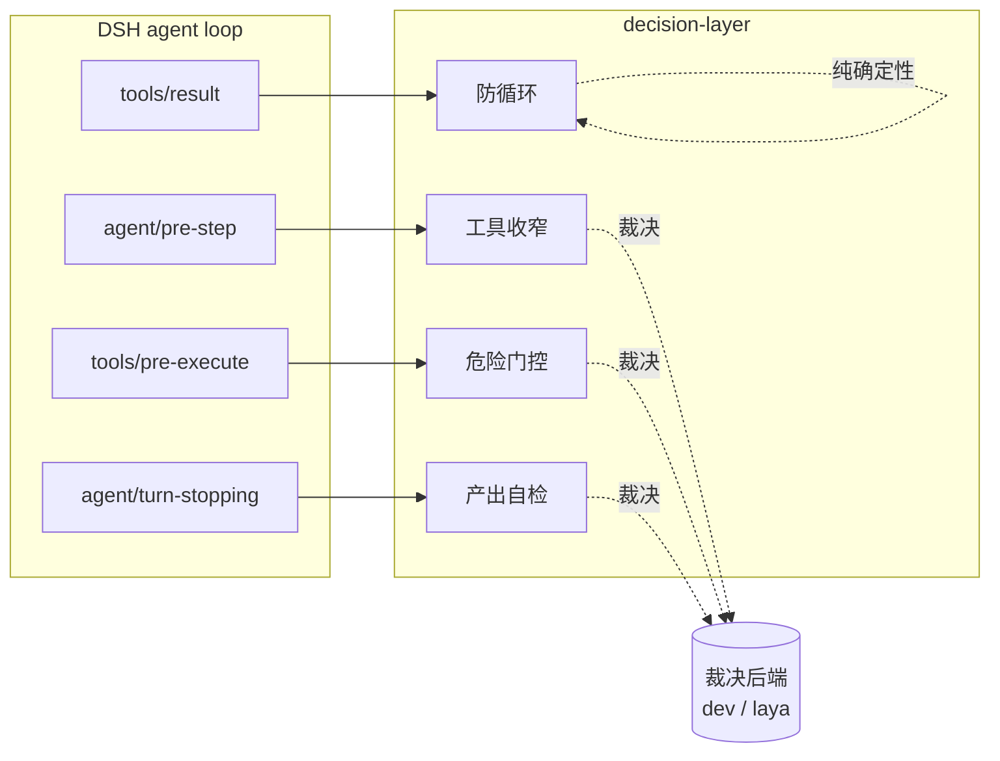

# dsh-decision-layer — 路线图

## 1. 这是什么

`dsh-decision-layer` 是一个 DeepSeek Harness（DSH）插件，给 agent loop 装上一层**结构化决策能力**。它把「要不要用这个工具」「这次危险操作放不放行」「这个产出算不算达标」这类**有明确边界的判断**，交给外部裁决模型（如 dev、laya 等）用结构化题型（二元概率 / 打分 / 单选）来回答，而不是让主模型自己拍脑袋。

裁决模型是**可插拔的后端**：插件只依赖「给一个 state 和一组问题，返回结构化答案」这个契约，不绑定任何单一供应商或单一模型。

本项目带**研究性质**，采取「干中学」（边干边学）的推进方式。裁决模型介入 agent loop 是一条尚未被充分验证的路径——哪些决策点真能带来收益、阈值定在哪、介入的体感如何，都缺乏现成答案。因此路线图刻意**小步快跑、优先做能立刻观察到效果的决策点**，每落一个就用真实数据回看，再决定下一步的取舍，而不是一次性把设计做满。这也是决策点优先级会随实测调整、部分能力标记「按实测收益决定去留」的原因。

## 2. 定位与边界

**做什么**

- 在 DSH 的生命周期钩子上介入，把关键决策点交给裁决模型。
- 提供 per-session 开关，默认行为可配，随时一键关闭。
- 自动介入**只收窄 / 只门控，不新增能力**：可能隐藏工具、要求用户确认或拒绝危险调用，永不给 agent 它本来没有的权限。
- 后端超时、报错或低置信时，不让裁决层替宿主作决定：收窄与自检跳过介入；危险门控交回 DSH 原生审批，不自行放行，也不绕过宿主权限。

**不做什么**

- 不替代主模型做开放式规划、写作、研究。
- 不做需要多端点才有意义的模型路由（除非将来确有多后端场景）。
- 不做与 DSH 原生语义路由重叠的 skill 自动路由。
- 不缓存、不训练、不持久化决策历史（首期）。

## 3. 核心设计原则

| 原则 | 含义 |
| --- | --- |
| 后端可插拔 | 只依赖「state + questions → 结构化答案」契约，模型 URL / Key / model 名均可配 |
| 只减不增 | 收窄只能从当前可见且已获许可的工具集里删；门控可以要求确认或拒绝，不能替宿主授权 |
| 失败回退到宿主 | 收窄/自检失败时跳过介入；危险门控失败时交由 DSH 原生审批，不能把后端异常解释为授权 |
| 开关即刹车 | per-session 开关一键关闭立即回到零介入 |
| 介入可见 | 每次收窄 / 门控都在对话侧可查，默认生效的前提是「看得见它干了什么」 |
| 提供默认值 + 可配 | URL、model、rubric 等有默认值，Key 仍须用户提供；开放配置供按需调整 |
| 参数可配 | 阈值、重复上限、rubric 等写入配置，不用魔法数字 |

## 4. 裁决后端契约

插件只要求端点支持同一裁决协议：接受一个 `state`（任务上下文）+ 一组 `questions`，返回每题的结构化答案。URL 与模型可切换；仅更换 model 字符串不等于支持任意不兼容的 API 协议。三种题型：

- **二元概率（noul）**：「这步需要用到工具 X 吗？」→ 返回 0~1 概率。
- **打分（score）**：「这个产出的完整度如何？」→ 返回 N 级评分 + 置信度。
- **单选（choice）**：「这次危险操作应该放行 / 先问用户 / 拒绝？」→ 返回选中项 + 各项概率。

后端配置项（配置页 + 环境变量回落）：

- **URL**：裁决服务地址；默认 `https://api.typesafe.ai`，也可指向遵循同一协议的其他端点。
- **Key**：鉴权密钥；须由用户在配置页或环境变量提供，不内置密钥。
- **model**：裁决模型名；默认 `jev-latest`，可输入其他受端点支持的模型名（如 dev、laya）。

配置优先级为已保存的非空值 → `DSH_DECISION_BASE_URL` / `DSH_DECISION_API_KEY` / `DSH_DECISION_MODEL` → 兼容的 `TYPESAFE_BASE_URL` / `TYPESAFE_API_KEY`（仅 URL、Key）→ URL 与 model 内置默认值。Key 缺失时应提示配置；默认地址与模型不代表无密钥即可发起裁决。配置自定义端点时需提示评估上下文会发往该地址；发送前最小化上下文、验证地址和结构化响应，不在日志或配置读取接口回显明文 Key。HTTP 地址不默认发送请求：使用前须对具体目标地址显式确认明文传输风险；地址变更后重新确认，headless 环境无法确认时拒绝向该 HTTP 地址发送 Key 或上下文。

## 5. 决策点地图（挂载到哪些 DSH 钩子）

| 决策点 | DSH 钩子 | 用后端? | 说明 |
| --- | --- | --- | --- |
| 工具收窄 | `agent/pre-step` | 是（noul） | 组装模型请求前，摘掉与任务不相关的工具 |
| 危险门控 | `tools/pre-execute` | 是（choice） | 破坏性调用执行前，判定放行 / 问用户 / 拒绝 |
| 产出自检 | `agent/turn-stopping` | 是（score） | 回合结束前打分；低分默认只提示，配置后才 steer 补完 |
| 防循环 | `tools/result` + `tools.guard` | 否 | 同一调用重复达阈值即拦，纯确定性、不计费 |
| 手动裁决 | skill（显式调用） | 是（任意题型） | 供用户主动发起一次裁决，体验后端能力、不介入 loop |

## 6. 手动裁决 skill（体验入口）

除自动介入外，插件注册一个**手动裁决 skill**，供用户显式发起一次结构化裁决——给一段 state 和几个问题，直接拿到裁决结果。用途：

- **体验裁决能力**：不必等 agent loop 触发，用户随时能感受后端在做什么。
- **调试后端**：验证 URL / Key / model 配置是否可用，看真实的概率 / 打分输出。
- **零介入**：只返回结果，不改 agent 行为；手动裁决与连通测试都不计入自动裁决总数或介入指标。

## 7. 用户体感：介入面板（点击开关弹 modal）

输入框左侧的按钮显示本会话总开关状态；点击后弹出介入面板，依次展示自动裁决指标、观察信号和配置。开关在面板内操作，按钮本身不直接切换状态。手动裁决与连通测试是体验和排障入口，不计入面板的任何自动裁决计数。

### 指标分期

- **v0.1**：只有手动裁决，没有自动决策点；面板提供配置与「尚无自动裁决」空态，不显示无意义的 0% 或承诺计数增长。按钮上的总开关是未来自动介入的会话偏好，并标明当前版本没有自动介入；关闭它不影响显式手动裁决。
- **v0.2**：危险门控上线后展示门控评估尝试数、有效结果数、建议放行/问用户/拒绝数及失败回退数；实际审批或执行结果另列。门控建议命中率 = （有效结果中的问用户建议数 + 拒绝建议数）/ 有效结果数；失败回退和未匹配调用不混入分母。没有有效结果时显示「—」。
- **v0.3**：增加自检评估数和低分数；自检低分率 = 低分数 / 自检评估数。分母为 0 时显示「—」。
- **v0.4**：如工具收窄实际落地，再展示收窄评估数、至少摘除一个工具的次数、累计摘除工具数。收窄命中率 = 有摘除动作的收窄评估数 / 收窄评估数；平均摘除工具数 = 累计摘除工具数 / 收窄评估数。平均数可能大于 1，不能称作百分比。

**自动裁决总数**是已向后端发起的门控、自检、收窄评估次数之和，包含发起后失败的请求；失败回退数单列。手动裁决、连通测试、防循环以及未匹配或总开关关闭后跳过的调用均不计入。模型建议与最终实际执行结果分开记录；仅在真实自动评估发生后才增加计数，分母为 0 时显示「—」。面板只展示当前版本已上线的指标，不把尚未实现的能力呈现为运行中的功能。

### 配置

总开关默认开启，按会话生效；各决策点的独立开关和关键阈值按功能版本逐步开放。面板提供后端 URL / Key / model 配置与连通测试；Key 不回显。累计用量与耗时为可选观察信号，不据此宣称实际节省了成本或提升了正确率。

## 8. 路线图

**v0.1–v0.4 是内部迭代里程碑，不分别发布 npm 包、GitHub Release 或 GitHub Packages。**各阶段可以在本地开发、测试与提交源码；待能力集成、验证达到发布标准且用户明确同意后，再另行确定首个公开版本和发布时间。

### v0.1 — 骨架与后端契约

- 仓库骨架、LICENSE、干净的 git 历史；不带入许可不明的上游实现。只允许经提交溯源确认、可与上游表达分离的本人原创代码复用；基于上游代码的混合文件重新实现。
- 裁决后端封装：兼容同一协议的可配置 URL / Key / model，默认 `https://api.typesafe.ai` + `jev-latest`；支持配置页、环境变量回落与连通测试（需用户提供 Key）。
- **手动裁决 skill**：显式发起一次裁决，作为体验 / 调试入口；不计入自动介入指标。
- per-session 总开关默认开；输入框左侧按钮点击弹介入面板。v0.1 交付后端配置、开关及尚无自动裁决的指标空态，数据从首个自动决策点上线后产生。

### v0.2 — 危险门控（首个自动决策点）

- `tools/pre-execute` 在破坏性调用执行前用 choice 给出放行 / 问用户 / 拒绝建议；默认「问用户」。模型的放行建议不得覆盖 DSH 原生权限或审批。
- 后端超时、报错、低置信或结果不合法时，移交 DSH 原生审批，而非强制 allow；实现前须验证钩子次序、宿主审批是否启用以及实际交接方式。无法可靠交接时保守阻止当前危险调用并提示用户，不把故障误当授权。
- 危险模式清单：**内置一部分**（rm -rf、force push、drop table、写生产配置等），**允许用户增删配置**；按工具类型评估命令内容与目标路径，避免只检查 bash 前缀。
- 门控记录进入可见性框架（评估数、建议、实际处理结果与失败回退分开统计）；上线后回看误判与用户确认负担，再决定后续规则。

### v0.3 — 产出自检

- `agent/turn-stopping` 回合结束前，用 score 题型给最终产出打分。
- **rubric（评分量表）**：内置一套固定通用 rubric 作默认（开箱即用），配置页允许懂的用户覆盖维度与档位描述。
- **低分行为**：默认**只提示、不打断**（在 tooltip / 日志标记「本回合自检得分偏低」，纯观测）；配置项允许切换到**硬 steer 补完**（逼主模型再跑一轮）。
- 单次不反复，阈值可配，避免拖长回合。

### v0.4 — 防循环 + 工具收窄

- 确定性防循环 guard（不走后端）。
- 工具收窄（noul）只对当前宿主已允许的工具集取交集，不扩权；结果为空、失效或不合法时跳过收窄。评估真实收益后决定 enforce、只提示或不保留。

### v0.5+ — 待定

- 多后端 / 模型路由（仅当确有多端点场景）。
- 决策历史可视化（对话内卡片）。

## 9. 设计取舍与代码来源

- **端点可替换**：默认接入 `https://api.typesafe.ai`，也允许用户配置实现同一协议的其他端点及模型名；不宣称兼容任意 API。
- **先验证再扩展**：先做危险门控与产出自检，工具收窄留到实测后再决定是否启用；每个决策点上线后回看误判、负担与耗时。
- **介入可见、随时关闭**：按功能上线顺序展示有效指标；总开关只控制自动介入，显式手动裁决仍可用。
- **来源边界**：不复制许可不明的上游实现。只有通过提交和具体代码片段核实、确属本人独立创作且不包含上游表达的部分，才可纳入本项目；改动过的混合文件不因此整体变成可复用代码。无法分清来源时按公开协议和本项目需求独立实现，并对拟复用部分留本地审查记录。

## 10. 待实现前核对

- 危险模式清单内置哪些条目最合理？如何按工具名、命令内容和目标路径配置规则并防止误判？
- v0.2 前需核实 DSH 原生审批与 `tools/pre-execute` 的关系：能否可靠移交；不能移交时采用当前危险调用的保守拒绝路径。
- 自定义 HTTP 端点需对具体地址显式确认明文传输风险，变更地址须重新确认；headless 无法确认时拒绝发送。落实时验证本机与远程 HTTP 都不能绕过这条规则。
- 产出自检切到硬 steer 时，steer 的措辞与重试次数如何避免与主模型打架？

### 已定：产出自检的 rubric（A + B）

产出自检用 score 题型，需要一套 rubric（评分量表）告诉裁决模型「按什么维度、分几档、每档什么标准」打分。采用**默认 + 可配**：

- **内置默认 rubric**（开箱即用）：一套朴素通用维度，如「是否答到了用户的问题 / 有没有明显遗漏 / 是否自相矛盾」，3~5 档。装上即生效，用户无需任何配置。
- **允许覆盖**（可配）：配置页开放 rubric 的维度与档位描述，懂的用户可按自己的质量标准改写。

低分后的行为同样是默认 + 可配：默认**只提示不打断**（纯观测，先攒数据看裁决判得准不准），配置项可切到**硬 steer 补完**。这符合项目的干中学取向——先用最低风险的观测形态跑起来，再依据真实打分数据决定是否收紧。
