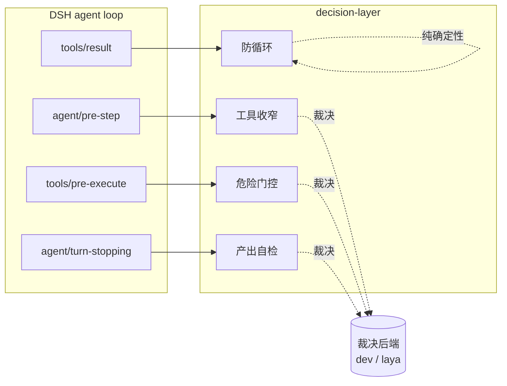

# dsh-decision-layer — 路线图

## 1. 这是什么

`dsh-decision-layer` 是一个 DeepSeek Harness（DSH）插件，给 agent loop 装上一层**结构化决策能力**。它把「要不要用这个工具」「这次危险操作放不放行」「这个产出算不算达标」这类**有明确边界的判断**，交给外部裁决模型（如 dev、laya 等）用结构化题型（二元概率 / 打分 / 单选）来回答，而不是让主模型自己拍脑袋。

裁决模型是**可插拔的后端**：插件只依赖「给一个 state 和一组问题，返回结构化答案」这个契约，不绑定任何单一供应商或单一模型。

本项目带**研究性质**，采取「干中学」（边干边学）的推进方式。裁决模型介入 agent loop 是一条尚未被充分验证的路径——哪些决策点真能带来收益、阈值定在哪、介入的体感如何，都缺乏现成答案。因此路线图刻意**小步快跑、优先做能立刻观察到效果的决策点**，每落一个就用真实数据回看，再决定下一步的取舍，而不是一次性把设计做满。这也是决策点优先级会随实测调整、部分能力标记「按实测收益决定去留」的原因。

## 2. 定位与边界

**做什么**

- 在 DSH 的生命周期钩子上介入，把关键决策点交给裁决模型。
- 提供 per-session 开关，默认行为可配，随时一键关闭。
- 所有介入**只收窄 / 只门控，不新增能力**：最坏情况是少一个工具、多问一句，永不给 agent 它本来没有的权限。
- 失败即放行（fail-open）：裁决后端超时、报错、低置信，一律退回无介入状态，绝不阻断主流程。

**不做什么**

- 不替代主模型做开放式规划、写作、研究。
- 不做需要多端点才有意义的模型路由（除非将来确有多后端场景）。
- 不做与 DSH 原生语义路由重叠的 skill 自动路由。
- 不缓存、不训练、不持久化决策历史（首期）。

## 3. 核心设计原则

| 原则 | 含义 |
| --- | --- |
| 后端可插拔 | 只依赖「state + questions → 结构化答案」契约，模型 URL / Key / model 名均可配 |
| 只减不增 | 收窄只能从当前可见工具集里删；门控只能拒绝，不能授权 |
| 失败即放行 | 任何后端异常都退回无介入，裁决层挂掉不能让 agent 瘫痪 |
| 开关即刹车 | per-session 开关一键关闭立即回到零介入 |
| 介入可见 | 每次收窄 / 门控都在对话侧可查，默认生效的前提是「看得见它干了什么」 |
| 参数可配 | 阈值、重复上限等写入配置，不用魔法数字 |

## 4. 裁决后端契约

插件对后端的唯一要求：接受一个 `state`（任务上下文）+ 一组 `questions`，返回每题的结构化答案。三种题型：

- **二元概率（noul）**：「这步需要用到工具 X 吗？」→ 返回 0~1 概率。
- **打分（score）**：「这个产出的完整度如何？」→ 返回 N 级评分 + 置信度。
- **单选（choice）**：「这次危险操作应该放行 / 先问用户 / 拒绝？」→ 返回选中项 + 各项概率。

后端配置项（配置页 + 环境变量回落）：

- **URL**：裁决服务地址，留空回落到环境变量。
- **Key**：鉴权密钥，留空回落到环境变量。
- **model**：裁决模型名（如 dev、laya），留空回落到默认；自由文本输入，端点新增模型无需改代码。

## 5. 决策点地图（挂载到哪些 DSH 钩子）

| 决策点 | DSH 钩子 | 用后端? | 说明 |
| --- | --- | --- | --- |
| 工具收窄 | `agent/pre-step` | 是（noul） | 组装模型请求前，摘掉与任务不相关的工具 |
| 危险门控 | `tools/pre-execute` | 是（choice） | 破坏性调用执行前，判定放行 / 问用户 / 拒绝 |
| 产出自检 | `agent/turn-stopping` | 是（score） | 回合结束前，给最终产出打分，低分则 steer 补完 |
| 防循环 | `tools/result` + `tools.guard` | 否 | 同一调用重复达阈值即拦，纯确定性、不计费 |
| 手动裁决 | skill（显式调用） | 是（任意题型） | 供用户主动发起一次裁决，体验后端能力、不介入 loop |

## 6. 手动裁决 skill（体验入口）

除自动介入外，插件注册一个**手动裁决 skill**，供用户显式发起一次结构化裁决——给一段 state 和几个问题，直接拿到裁决结果。用途：

- **体验裁决能力**：不必等 agent loop 触发，用户随时能感受后端在做什么。
- **调试后端**：验证 URL / Key / model 配置是否可用，看真实的概率 / 打分输出。
- **零介入**：只返回结果，不改 agent 行为，是自动决策层之外的安全体验通道。

## 7. 用户体感：介入可见性

裁决结果目前「感受不到」是核心痛点。可见性分两层：

- **计数**：per-session 开关的 tooltip 显示**裁决总量计数**（本会话累计发起了多少次裁决、其中收窄/门控/放行各多少），让用户直观看到「它一直在干活」。
- **明细**：tooltip 继续显示最近若干次介入的摘要（收窄了哪些工具、门控拦了什么）。

计数是这一版补强体感的重点——即便某次裁决没有产生收窄（工具全部相关），计数也会 +1，用户由此确认后端确实在每步参与，而非「没触发」。

## 8. 路线图

### v0.1 — 骨架与后端契约

- 仓库骨架、LICENSE、干净的 git 历史，与任何既有仓库无代码 / 文档 / 提交关联。
- 裁决后端封装：URL / Key / model 三项可配，配置页 + 环境变量回落，连通测试。
- **手动裁决 skill**：显式发起一次裁决，作为体验 / 调试入口。
- per-session 开关（输入框左侧），**默认开**，介入可见性框架：tooltip 显示**裁决总量计数** + 最近介入明细。

### v0.2 — 危险门控（首个自动决策点）

- `tools/pre-execute` 拦破坏性调用，用 choice 判定放行 / 问用户 / 拒绝，默认「问用户」。
- 危险模式清单：**内置一部分**（rm -rf、force push、drop table、写生产配置等），**允许用户增删配置**。
- 门控记录进入可见性框架（计数 + 明细）。

### v0.3 — 产出自检

- `agent/turn-stopping` 对最终产出按 rubric 打分，低于阈值 steer 一句要求补完。
- rubric 的形态待讨论（见第 10 节）。
- 单次不反复，阈值可配，避免拖长回合。

### v0.4 — 防循环 + 工具收窄

- 确定性防循环 guard（不走后端）。
- 工具收窄（noul），评估其实际收益后决定 enforce 还是仅提示。

### v0.5+ — 待定

- 多后端 / 模型路由（仅当确有多端点场景）。
- 决策历史可视化（对话内卡片）。

## 9. 与既有方案的区别

裁决层的思路在社区有过若干实现，本项目从零重写，定位差异：

- **后端中立**：不绑定单一供应商，dev / laya 等模型皆可作为裁决后端。
- **研究性质、干中学**：小步快跑，每个决策点用真实数据回看再决定去留，而非一次做满。
- **决策点优先级不同**：先做危险门控与产出自检（后端判断价值高、触发点明确），工具收窄降为后置、按实测收益决定去留。
- **默认可见、默认可关**：任何介入都在对话侧可查（含裁决总量计数），开关一键回到零介入。

## 10. 待决问题

- **产出自检的 rubric 是什么形态**？（固定内置 / 用户可配 / 按任务类型自动选，待讨论——见下）
- 危险模式清单内置哪些条目最合理？用户配置的粒度（正则 / 命令前缀 / 工具名）？
- 产出自检低分后，steer 的措辞与重试次数如何避免与主模型打架？

### 关于 rubric（待讨论）

「rubric」指**评分量表**——告诉裁决模型「按什么维度、分几档、每档什么标准」去给产出打分。产出自检要用 score 题型，就必须先定义 rubric，否则「打分」无从谈起。几种可选形态：

1. **固定通用 rubric**：一套写死的维度（如「完整性 / 是否答到点 / 有无明显遗漏」，1~5 档），所有回合通用。简单，但对不同任务（写代码 vs 查资料）不够贴合。
2. **用户可配 rubric**：配置页让用户自定义维度与档位描述。灵活，但要求用户懂怎么写量表，门槛高。
3. **按任务类型自动选**：预置几套 rubric（编码 / 研究 / 写作），按当前任务自动挑一套。折中，但「判断任务类型」本身又是一次裁决，复杂度上升。

这个决定影响 v0.3 的设计，我们单独讨论后再定。
