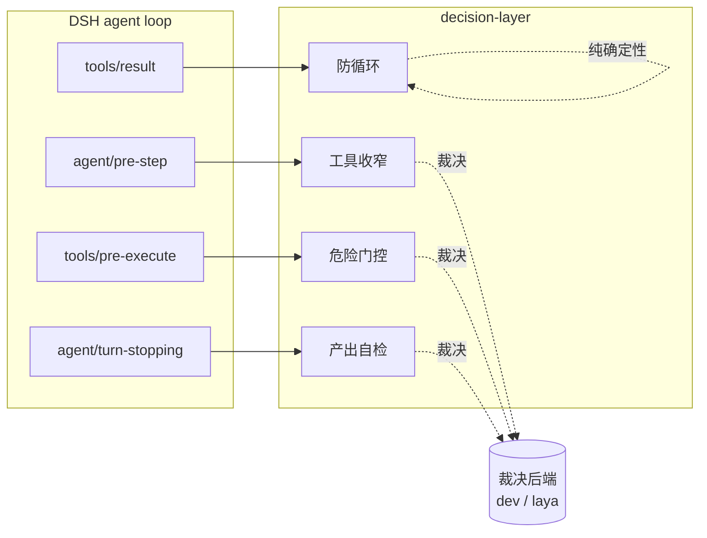

# dsh-decision-layer — 路线图

## 1. 这是什么

`dsh-decision-layer` 是一个 DeepSeek Harness（DSH）插件，给 agent loop 装上一层**结构化决策能力**。它把「要不要用这个工具」「这次危险操作放不放行」「这个产出算不算达标」这类**有明确边界的判断**，交给外部裁决模型（如 dev、laya 等）用结构化题型（二元概率 / 打分 / 单选）来回答，而不是让主模型自己拍脑袋。

裁决模型是**可插拔的后端**：插件只依赖「给一个 state 和一组问题，返回结构化答案」这个契约，不绑定任何单一供应商或单一模型。

## 2. 定位与边界

**做什么**

- 在 DSH 的生命周期钩子上介入，把关键决策点交给裁决模型。
- 提供 per-session 开关，默认行为可配，随时一键关闭。
- 所有介入**只收窄 / 只门控，不新增能力**：最坏情况是少一个工具、多问一句，永不给 agent 它本来没有的权限。
- 失败即放行（fail-open）：裁决后端超时、报错、低置信，一律退回无介入状态，绝不阻断主流程。

**不做什么**

- 不替代主模型做开放式规划、写作、研究。
- 不做需要多端点才有意义的模型路由（除非将来确有多后端场景）。
- 不做与 DSH 原生语义路由重叠的 skill 自动路由。
- 不缓存、不训练、不持久化决策历史（首期）。

## 3. 核心设计原则

| 原则 | 含义 |
| --- | --- |
| 后端可插拔 | 只依赖「state + questions → 结构化答案」契约，模型 URL / Key / model 名均可配 |
| 只减不增 | 收窄只能从当前可见工具集里删；门控只能拒绝，不能授权 |
| 失败即放行 | 任何后端异常都退回无介入，裁决层挂掉不能让 agent 瘫痪 |
| 开关即刹车 | per-session 开关一键关闭立即回到零介入 |
| 介入可见 | 每次收窄 / 门控都在对话侧可查，默认生效的前提是「看得见它干了什么」 |
| 参数可配 | 阈值、重复上限等写入配置，不用魔法数字 |

## 4. 裁决后端契约

插件对后端的唯一要求：接受一个 `state`（任务上下文）+ 一组 `questions`，返回每题的结构化答案。三种题型：

- **二元概率（noul）**：「这步需要用到工具 X 吗？」→ 返回 0~1 概率。
- **打分（score）**：「这个产出的完整度如何？」→ 返回 N 级评分 + 置信度。
- **单选（choice）**：「这次危险操作应该放行 / 先问用户 / 拒绝？」→ 返回选中项 + 各项概率。

后端配置项（配置页 + 环境变量回落）：

- **URL**：裁决服务地址，留空回落到环境变量。
- **Key**：鉴权密钥，留空回落到环境变量。
- **model**：裁决模型名（如 dev、laya），留空回落到默认；自由文本输入，端点新增模型无需改代码。

## 5. 决策点地图（挂载到哪些 DSH 钩子）

| 决策点 | DSH 钩子 | 用后端? | 说明 |
| --- | --- | --- | --- |
| 工具收窄 | `agent/pre-step` | 是（noul） | 组装模型请求前，摘掉与任务不相关的工具 |
| 危险门控 | `tools/pre-execute` | 是（choice） | 破坏性调用执行前，判定放行 / 问用户 / 拒绝 |
| 产出自检 | `agent/turn-stopping` | 是（score） | 回合结束前，给最终产出打分，低分则 steer 补完 |
| 防循环 | `tools/result` + `tools.guard` | 否 | 同一调用重复达阈值即拦，纯确定性、不计费 |

## 6. 路线图

### v0.1 — 骨架与后端契约

- 仓库骨架、LICENSE、干净的 git 历史，与任何既有仓库无代码 / 文档 / 提交关联。
- 裁决后端封装：URL / Key / model 三项可配，配置页 + 环境变量回落，连通测试。
- per-session 开关（输入框左侧），默认状态待定，介入可见性框架（tooltip）。

### v0.2 — 危险门控（首个后端决策点）

- `tools/pre-execute` 拦破坏性调用，用 choice 判定放行 / 问用户 / 拒绝，默认「问用户」。
- 危险模式识别清单（rm -rf、force push、drop table、写生产配置等）可配。
- 门控记录进入可见性框架。

### v0.3 — 产出自检

- `agent/turn-stopping` 对最终产出按 rubric 打分，低于阈值 steer 一句要求补完。
- 单次不反复，阈值可配，避免拖长回合。

### v0.4 — 防循环 + 工具收窄

- 确定性防循环 guard（不走后端）。
- 工具收窄（noul），评估其实际收益后决定 enforce 还是仅提示。

### v0.5+ — 待定

- 多后端 / 模型路由（仅当确有多端点场景）。
- 决策历史可视化（对话内卡片）。
- 按需评估工具（供 agent 显式调用做有界决策）。

## 7. 与既有方案的区别

裁决层的思路在社区有过若干实现，本项目从零重写，定位差异：

- **后端中立**：不绑定单一供应商，dev / laya 等模型皆可作为裁决后端。
- **决策点优先级不同**：先做危险门控与产出自检（后端判断价值高、触发点明确），工具收窄降为后置、按实测收益决定去留。
- **默认可见、默认可关**：任何介入都在对话侧可查，开关一键回到零介入。

## 8. 待决问题

- per-session 开关默认开还是默认关？（危险门控默认开更安全，但可能打断流程）
- 危险模式清单内置多少、留多少给用户配？
- 产出自检的 rubric 是固定的还是可配的？
- npm 包名用 `dsh-decision-layer` 还是 scoped `@xbzbing/dsh-decision-layer`？
